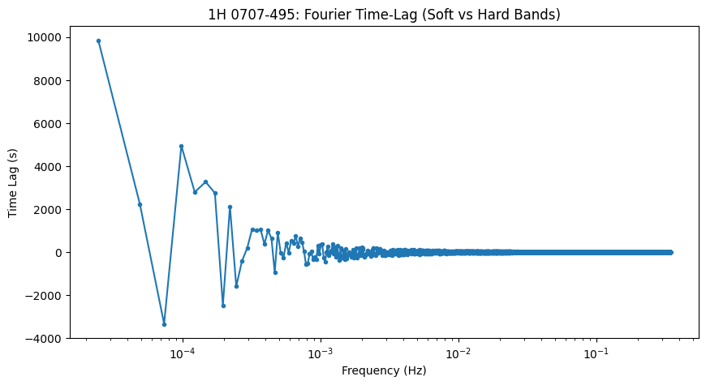
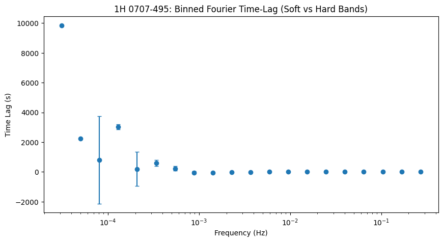

# Fourier Time-Lag Analysis of X-ray Light Curves in AGN 1H 0707-495

## Introduction
This project analyzes the X-ray variability of the active galactic nucleus (AGN) **1H 0707-495** using data from the **XMM-Newton EPIC-pn instrument**. The main objectives are:

- Extract energy-resolved light curves.
- Separate light curves into soft (lower energy) and hard (higher energy) X-ray bands.
- Perform Fourier-based time-lag analysis to study the temporal relationship between bands, providing insights into processes near the black hole, such as disk reverberation and corona variability.

---

## Data
- **Observation ID:** 0110890201  
- **Instrument:** EPIC-pn (XMM-Newton)  
- **Data Type:** PPS (Pipeline Processing System) FITS files  
- Contains energy-resolved light curves, spectra, and auxiliary files.

---

## Workflow / Methodology
The analysis follows these steps:

1. Upload and extract the PPS tarball in Colab.
2. Inspect FITS files and identify the EPIC-pn light curve (PNX file).
3. Separate soft and hard energy bands using RATE columns (RATE4 for soft, RATE5 for hard).
4. Plot the light curves for both bands to inspect variability.
5. Compute Fourier transform and cross-spectrum of soft and hard bands.
6. Derive frequency-dependent time lags.
7. Apply logarithmic frequency binning for smoother, publication-ready plots.

---

## Results

### Soft vs Hard X-ray Light Curves
The soft and hard light curves show clear correlated variability, with the soft band generally following the hard band.

### Frequency-Binned Time-Lag Plot
The binned time-lag plot shows that at low frequencies, the soft band lags the hard band, consistent with disk reverberation models.

---

## Conclusion
- Successfully extracted energy-resolved light curves and performed Fourier-based time-lag analysis.  
- Observed soft lags at low frequencies are consistent with reverberation of hard X-ray variations in the accretion disk.  
- Demonstrates skills in **FITS file handling**, **Python analysis**, **light curve extraction**, and **Fourier timing techniques**.

---

## Dependencies / Requirements
- **Python 3.x**  
- **Libraries:** `numpy`, `matplotlib`, `astropy`  
- Run in Google Colab or any Python environment with the above packages installed.

---

## Usage
1. Upload the PPS tarball to Colab.
2. Extract the tarball.
3. Run the notebook step-by-step:
   - Inspect FITS files.
   - Separate soft and hard bands.
   - Plot light curves.
   - Compute Fourier time lags and binned lag plots.

---

## References
- [XMM-Newton Science Archive](https://www.cosmos.esa.int/web/xmm-newton)  
- Kara et al., 2016, X-ray Reverberation in AGN  
- Uttley et al., 2014, X-ray Timing Techniques in AGN

---

## Future Work / Enhancements
- Automate energy band selection from FITS headers.  
- Include Monte Carlo simulations for lag uncertainties.  
- Compare multiple observations of the same AGN to study long-term variability.  
- Extend analysis to multi-instrument datasets for cross-correlation studies.
